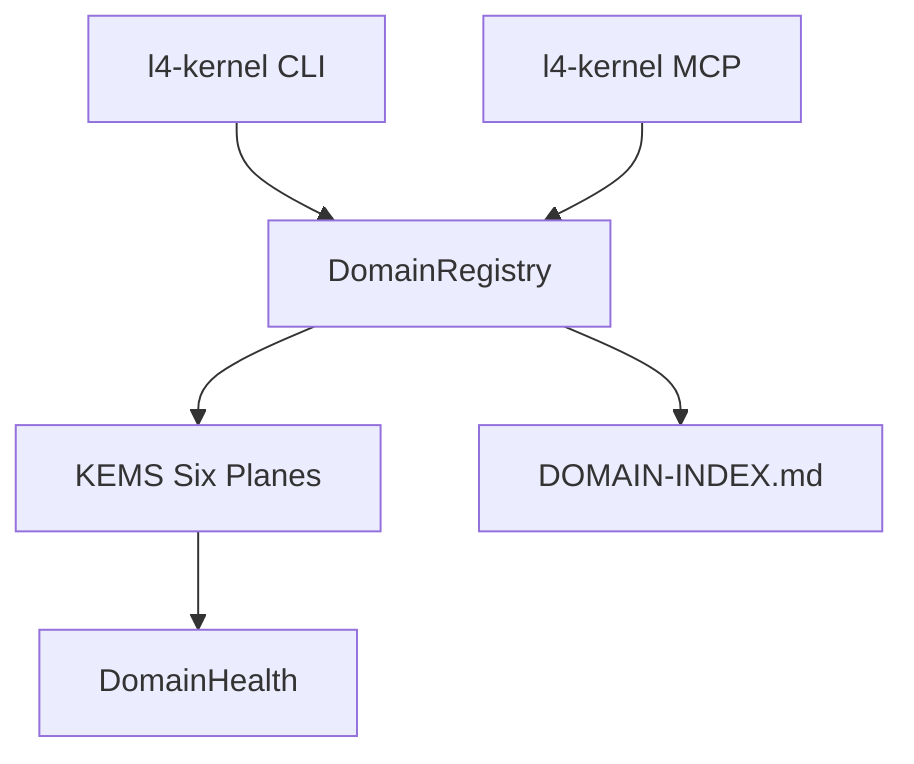

# l4-kernel — Architecture

> **Layer**: L4 自我层  
> **Role**: L4 管理面 — 19-21 域统一注册 / KEMS 六面治理 / 跨域信号  
> **Stack**: Python 3.13+, uv, fastmcp, pyyaml  
> **Health**: See local CI and runtime probes
> **SSOT**: 运行时健康、测试规模、域/工具计数以本项目 CI、运行时探针和 workspace governance SSOT 为准
>
> 系统全景参见：[`docs/ARCHITECTURE-DIAGRAM.md`](../docs/ARCHITECTURE-DIAGRAM.md)

---

## 1. 内部架构



## 2. 入口

| Type | Entry | Port / Notes |
|:--|:--|:--|
| CLI | `l4-kernel` | status/domain/governance/list |
| MCP stdio | `l4-kernel mcp` | ~42 tools |
| MCP HTTP | `l4-kernel mcp --http` | :7455 |
| MCP SSE | `l4-kernel mcp --sse` |  |

## 3. 核心模块

| Module | Responsibility |
|:--|:--|
| `src/l4_kernel/registry.py` | DomainRegistry + DOMAIN-INDEX sync |
| `src/l4_kernel/mcp_server.py` | MCP server |
| `src/l4_kernel/kems.py` | KEMS six-plane + Cards plane |
| `src/l4_kernel/health.py` | Cross-domain health aggregation |
| `src/l4_kernel/signals.py` | Cross-domain SignalBus |

## 4. 测试

```bash
cd projects/l4-kernel && make test
```
