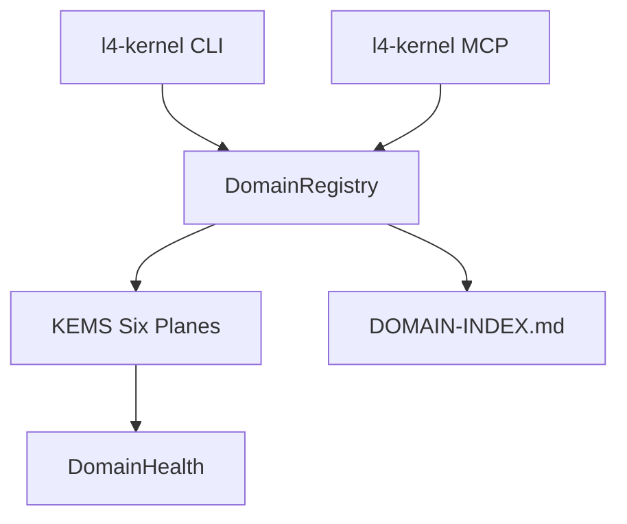

# l4-kernel — Architecture

> **Layer**: L4 自我层
> **Role**: L4 管理面 — 28 域统一注册 / KEMS 六面治理 / 跨域信号
> **Stack**: Python 3.13+, uv, fastmcp, pyyaml
> **Health**: See local CI and runtime probes
> **SSOT**: 运行时健康、测试规模、域/工具计数以本项目 CI、运行时探针和 workspace governance SSOT 为准
>
> 系统全景参见：[`../../docs/PANORAMA.md`](../../docs/PANORAMA.md)

---

## 1. 内部架构



## 2. 入口

| Type | Entry | Port / Notes |
|:--|:--|:--|
| CLI | `l4-kernel` | status/domain/governance/list |
| MCP stdio | `l4-kernel mcp` | MCP tools (见 project-registry.yaml: l4-kernel) |
| MCP HTTP | `l4-kernel mcp --http` | :7455 |
| MCP SSE | `l4-kernel mcp --sse` |  |

## 3. 核心模块

| Module | Responsibility |
|:--|:--|
| `registry.py` | DomainRegistry + DOMAIN-INDEX sync |
| `domain_types.py` | 7 种域类型特化 (Document/Config/Tool/...) |
| `domain_plugins.py` | 域插件注册与发现 |
| `mcp_server.py` | MCP server (MCP tools (见 project-registry.yaml: l4-kernel)) |
| `kems.py` | KEMS six-plane + Cards plane |
| `health.py` | Cross-domain health aggregation |
| `signals.py` | Cross-domain SignalBus |
| `lifecycle.py` | 域生命周期管理 |
| `concurrency.py` | 并发控制原语 |
| `consistency.py` | 跨域一致性检查 |
| `distributed.py` | 分布式协调 |
| `federation.py` | 域联邦机制 |
| `plugins.py` | 插件加载框架 |
| `skill_loader.py` | 技能加载器 |
| `templates.py` | 域骨架生成 + KEMS 版本迁移 |
| `claude_injector.py` | Claude 上下文注入 |
| `workflows.py` | 工作流引擎 |
| `cli.py` | CLI 入口 |

## 4. 测试

```bash
cd projects/l4-kernel && make test
```

## 架构概览

参见工作区架构概览图：[`../../docs/ARCHITECTURE-DIAGRAM.md`](../../docs/ARCHITECTURE-DIAGRAM.md)
