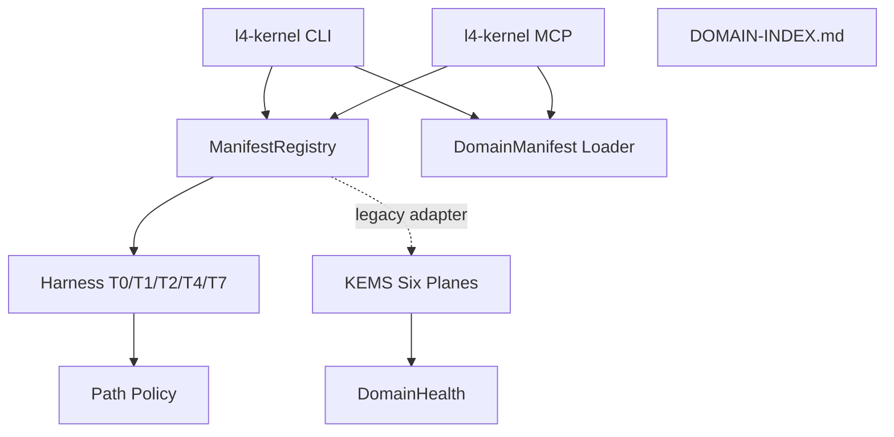

# l4-kernel — Architecture

> **Layer**: L4 自我层
> **Role**: L4 知识主权契约编译器与只读 Harness；旧 KEMS 管理面为兼容层
> **Stack**: Python 3.13+, uv, fastmcp, pyyaml
> **Health**: See local CI and runtime probes
> **SSOT**: 运行时健康、测试规模、域/工具计数以本项目 CI、运行时探针和 workspace governance SSOT 为准
>
> 系统全景参见：[`../../docs/PANORAMA.md`](../../docs/PANORAMA.md)

---

## 1. 内部架构


```mermaid

graph TB
    CLI[l4-kernel CLI]
    MCP[l4-kernel MCP]
    Reg[ManifestRegistry]
    Contract[DomainManifest Loader]
    Harness[Harness T0/T1/T2/T4/T7]
    Policy[Path Policy]
    KEMS[KEMS Six Planes]
    Health[DomainHealth]
    DomainIndex[DOMAIN-INDEX.md]

    CLI --> Contract
    MCP --> Contract
    CLI --> Reg
    MCP --> Reg
    Reg --> Harness
    Harness --> Policy
    Reg -. legacy adapter .-> KEMS
    KEMS --> Health

```

## 2. 入口

| Type | Entry | Port / Notes |
|:--|:--|:--|
| CLI | `l4-kernel` | contract/registry/harness；旧 domain/skill/workflow 标记 legacy |
| MCP stdio | `l4-kernel mcp` | MCP tools (见 project-registry.yaml: l4-kernel) |
| MCP HTTP | `l4-kernel mcp --http` | :7455 |
| MCP SSE | `l4-kernel mcp --sse` |  |

## 3. 核心模块

| Module | Responsibility |
|:--|:--|
| `contracts/` | DomainManifest/HarnessProfile/DomainHealth 严格契约 |
| `manifest_registry.py` | 显式 12 个知识域注册表；禁止混入工具/存储域 |
| `harness.py` | T0/T1/T2/T4/T7 只读确定性验证 |
| `path_policy.py` | 域内路径 containment 与默认拒绝直接写 |
| `registry.py` | LegacyRegistryAdapter 所需兼容模型 |
| `domain_types.py` | 7 种域类型特化 (Document/Config/Tool/...) |
| `domain_plugins.py` | 域插件注册与发现 |
| `mcp_server.py` | MCP server (MCP tools (见 project-registry.yaml: l4-kernel)) |
| `kems.py` | KEMS six-plane + Cards plane |
| `health.py` | Cross-domain health aggregation |
| `signals.py` | Cross-domain SignalBus |
| `lifecycle.py` | 域生命周期管理 |
| `concurrency.py` | 并发控制原语 |
| `consistency.py` | 跨域一致性检查 |
| `distributed.py` | 分布式协调 |
| `federation.py` | 域联邦机制 |
| `plugins.py` | 插件加载框架 |
| `skill_loader.py` | 技能加载器 |
| `templates.py` | 域骨架生成 + KEMS 版本迁移 |
| `claude_injector.py` | Claude 上下文注入 |
| `workflows.py` | 工作流引擎 |
| `cli.py` | CLI 入口 |

## 4. 权限与回滚边界

- 生产配置必须显式提供 `L4_DOMAIN_REGISTRY`。
- 默认直接写关闭；`L4_LEGACY_DIRECT_WRITE=1` 仅作短期回滚，且不能绕过 containment。
- `projection` 与 `federation` 域禁止 `canonical_write`。
- ContextPack 不在 Phase 0 接口内。

## 5. 测试

```bash
cd projects/l4-kernel && make test
```

## 架构概览

参见工作区架构概览图：[`../../docs/ARCHITECTURE-DIAGRAM.md`](../../docs/ARCHITECTURE-DIAGRAM.md)
