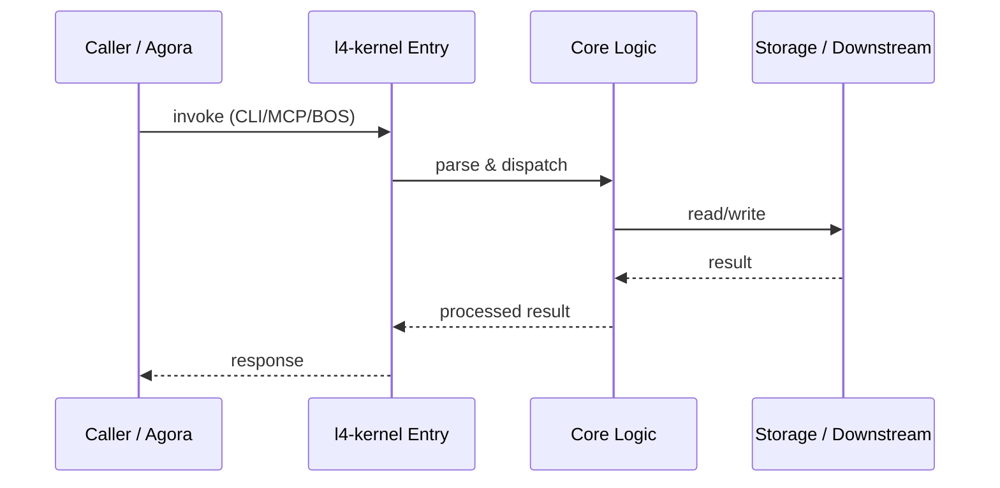

# l4-kernel — Call Chain

> 本文档描述 l4-kernel 内部最核心的一条调用链 / 数据流。
>
> 通用跨层调用链参见：[`docs/I0-AGORA-CALLCHAIN.md`](../docs/I0-AGORA-CALLCHAIN.md)

---

## 关键路径

1. 1. `l4-kernel` CLI or MCP tool requests domain operation
2. 2. `registry.py` loads/synchronizes DOMAIN-INDEX.md
3. 3. `domain_types.py` specializes 7 domain types
4. 4. `kems.py` performs six-plane read/write
5. 5. `health.py` aggregates domain health into dashboard

## Sequence Diagram

