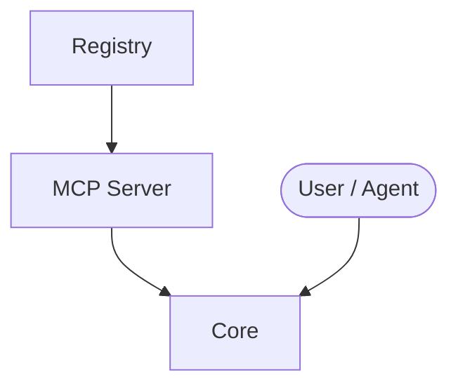

# L4 Kernel Architecture

> Architecture overview for **L4 Kernel**. For the full workspace architecture, see [`../../ARCHITECTURE.md`](../../ARCHITECTURE.md).

## Responsibilities

L4 Kernel is part of the eCOS v6 workspace. See [`../README.md`](../README.md) for a one-line description and [`../CAPABILITY-MAP.md`](../CAPABILITY-MAP.md) for capability mapping.

## Key Surfaces

- `src/l4_kernel/registry.py` — domain registry
- `src/l4_kernel/mcp_server.py` — MCP server
- `src/l4_kernel/` — core modules

## Design Notes

- Runtime facts (counts, ports, health) are intentionally not maintained here. Use the workspace registries and project source as the truth.
- For boundaries and call chains, read [`../BOUNDARY.md`](../BOUNDARY.md) and [`../CALLCHAIN.md`](../CALLCHAIN.md).
- For developer rules, read [`../AGENTS.md`](../AGENTS.md).

## Component Overview

- Arrows show typical interaction flow, not strict call direction.
- See [`../CALLCHAIN.md`](../CALLCHAIN.md) for detailed call chains.
